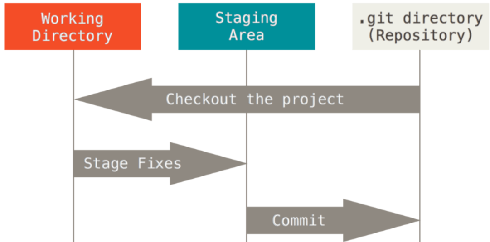

### 1. 分布式版本控制

**1. 版本控制是什么**

版本控制是一种记录一个或若干文件内容变化，以便将来查阅特定版本修订情况的系统。不仅可以对代码文件进行版本控制，对任何文件都可以进行版本控制．

**２. 集中式版本控制**

​		 集中化的版本控制系统(Centralized Version Control Systems，简称 CVCS)可以帮助在不同系统上的开发者协同工作. 这类系统，都有一个单一的集中管理的服务器，保存所有文件的修订版本，而协同工作的人们都通过客户端连到这台服务器，取出最新的文件或者提交更新。

​		这种做法带来了许多好处，特别是相较于老式的本地 VCS 来说。 现在，每个人都可以在一定程度上看到项目中的其他人正在做些什么。 而管理员也可以轻松掌控每个开发者的权限，并且管理一个 CVCS 要远比在各个客户端上维护本地数据库来得轻松容易。

​		事分两面，有好有坏。 **这么做最显而易见的缺点是中央服务器的单点故障**。 如果宕机一小时，那么在这一小时内，谁都无法提交更新，也就无法协同工作。 如果中心数据库所在的磁盘发生损坏，又没有做恰当备份，毫无疑问你将丢失所有数据——包括项目的整个变更历史，只剩下人们在各自机器上保留的单独快照。 本地版本控制系统也存在类似问题，只要整个项目的历史记录被保存在单一位置，就有丢失所有历史更新记录的风险。

 

 

**3.分布式版本控制系统**

​		分布式版本控制系统(Distributed Version Control System，简称 DVCS). 在这类系统中，像 Git、Mercurial、Bazaar 以及 Darcs 等，**客户端并不只提取最新版本的文件快照，而是把代码仓库完整地镜像下来**。 这么一来，任何一处协同工作用的服务器发生故障，事后都可以用任何一个镜像出来的本地仓库恢复。 因为每一次的克隆操作，实际上都是一次对代码仓库的完整备份。

  

**什么是仓库:** 用来存放代码的目录.


### 2. Git原理

#### ２.1 Git基础

 

==Git 在保存和对待各种信息的时候与其它版本控制系统有很大差异==，尽管操作起来的命令形式非常相近.

**1. 直接记录快照，而非差异比较**

>Git 和其它版本控制系统(包括 Subversion 和近似工具)的主要差别在于 Git 对待数据的方法。其它大部分系统以文件变更列表的方式存储信息。 这类系统(CVS、Subversion、Perforce、Bazaar 等等)将它们保存的信息看作是一组基本文件和每个文件随时间逐步累积的差异。存储每个文件与初始版本的差异.
>
>  
>
>
>
>
>Git 不按照以上方式对待或保存数据。 反之，==Git 更像是把数据看作是对小型文件系统的一组快照。 每次你提交更新，或在 Git 中保存项目状态时，它主要对当时的全部文件制作一个快照并保存这个快照的索引==。 为了高效，如果文件没有修改，Git 不再重新存储该文件，而是只保留一个链接指向之前存储的文件。 Git 对待数据更像是一个 快照流。
>
>这是 Git 与几乎所有其它版本控制系统的重要区别。 因此 Git 重新考虑了以前每一代版本控制系统延续下来的诸多方面。 Git 更像是一个小型的文件系统，提供了许多以此为基础构建的超强工具，而不只是一个简单的 VCS。
>
>  


**2. 近乎所有操作都是本地执行**

>在 Git 中的绝大多数操作都只需要访问本地文件和资源，一般不需要来自网络上其它计算机的信息。 因为你在本地磁盘上就有项目的完整历史，所以大部分操作看起来瞬间完成。
>
>举个例子，要浏览项目的历史，Git 不需外连到服务器去获取历史，然后再显示出来——它只需直接从本地数据库中读取。 你能立即看到项目历史。 如果想查看当前版本与一个月前的版本之间引入的修改，Git 会查找到一个月前的文件做一次本地的差异计算，而不是由远程服务器处理或从远程服务器拉回旧版本文件再来本地处理。 


**3. Git保证完整性**

>Git 中所有数据在存储前都计算校验和，然后以校验和来引用。 这意味着不可能在 Git 不知情时更改任何文件内容或目录内容。 这个功能建构在 Git 底层，是构成 Git 哲学不可或缺的部分。 若你在传送过程中丢失信息或损坏文件，Git 就能发现。
>
>Git 用以计算校验和的机制叫做 SHA-1 散列(hash，哈希)。 这是一个由 40 个十六进制字符(`0-9` 和 `a-f`)组成字符串，基于 Git 中文件的内容或目录结构计算出来。 SHA-1 哈希看起来是这样：24b9da6552252987aa493b52f8696cd6d3b0037
>
>Git 中使用这种哈希值的情况很多，你将经常看到这种哈希值。 实际上，Git 数据库中保存的信息都是以文件内容的哈希值来索引，而不是文件名。


==git的三种状态==

Git 有三种状态，你的文件可能处于其中之一：**已提交(committed)、已修改(modified)和已暂存(staged)**。 
**已提交**表示数据已经安全的保存在本地数据库中。 
**已修改**表示修改了文件，但还没保存到数据库中。 
**已暂存**表示对一个已修改文件的当前版本做了标记，使之包含在下次提交的快照中。
由此引入 Git 项目的三个工作区域的概念：Git 仓库、工作目录以及暂存区域。

> 
>
> 
>
>**Git 仓库目录**: 是 Git 用来保存项目的元数据和对象数据库的地方。 这是 Git 中最重要的部分，从其它计算机克隆仓库时，拷贝的就是这里的数据 .
>
>**工作目录**: 是对项目的某个版本独立提取出来的内容。 这些从 Git 仓库的压缩数据库中提取出来的文件，放在磁盘上供你使用或修改。
>
>**暂存区域**: 是一个文件，保存了下次将提交的文件列表信息，一般在 Git 仓库目录中。 有时候也被称作‘索引’，不过一般说法还是叫暂存区域。
>
>基本的 Git 工作流程如下：
>
>1. 在工作目录中修改文件。
>2. 暂存文件，将文件的快照放入暂存区域。
>3. 提交更新，找到暂存区域的文件，将快照永久性存储到 Git 仓库目录。
>
>如果 Git 目录中保存着的特定版本文件，就属于已提交状态。 如果作了修改并已放入暂存区域，就属于已暂存状态。 如果自上次取出后，作了修改但还没有放到暂存区域，就是已修改状态。 


####　２.2 Git安装与配置

**1. Linux下的安装**

>```shell
>sudo apt-install git   //安装git
>git --version          //查看git版本
>git --help
>git config --list      //查看git当前配置
>```


**2. Linux下Git的配置**

>此处配置主要是为git配置远程仓库, 在公司具体的开发时就会用公司的仓库名等信息.
>比如使用GitHub作为仓库时,就使用GitHub用户名和邮箱
>
>```shell
>##安装好后为git配置用户信息---设置用户签名,只用设置一次,不签名不能提交代码.
>$ git config --global user.name "用户名"
>$ git config --global user.email "邮箱名@yiibai.com"//git不会验证邮箱的真伪
>
>##获取公钥
>ssh-keygen -t rsa -C "youremail@example.com"  
>```
>
> 


**3. Windows下的安装**

>**网址**: https://git-scm.com/downloads 下载安装后,按照下面的步骤配置环境变量
>
>(1)使用 Win + S 打开，搜索「**环境变量**」，点击进入上方返回的「**编辑系统环境变量**」。
>
>(2)在打开的面板，点击右下角的**环境变量**。
>
>  
>
>(3)选中下方的「系统变量」中的「**Path**」，点击右下角的「**编辑**」。
>
>  
>
>(4)点击右侧的「新建」，最下方会弹出一个让我们输入内容的提示框，这里需要添加的是 **git.exe 的安装路径**。==一定是cmd下的git.exe==
>
> 
>
>
>
>在配好git的环境变量后可能鼠标右击没有出现==Git Bash Here==，可以按照下面的方法进行设置。便于我们使用git
>
>[鼠标右键没有git bash here，右键添加git bash here并增加图标_Feng&Y的博客-CSDN博客_鼠标右键没有git](https://blog.csdn.net/qq_41019529/article/details/110139830)


**4.Windows下Git的配置**

>对于我个人使用的是GitHub的仓库, 所以以GitHub仓库为例子
>
>```shell
>a>配置用户名： git config --global user.name  （Github上注册的用户名）
>b>配置用户邮箱：git config --global user.email  （GitHub上注册时的邮箱）
>
>c>在Git终端在输入: ssh-keygen -t rsa -C "xxxxx@example.com" ( GitHub上注册时的邮箱 )
>```
>
>  
>
>
>
>1. 得到公钥之后，打开 GitHub 官网，点击右上角的个人头像，选择 Settings 打开设置页面。
>
>  
>
>2. 左侧栏切换到 **SSH and GPG keys** 选项卡，点击右上角的 **New SSH key**。
>
>   
>
>3. 在打开的 SSH 配置页面，**在 Key 里面粘贴从 PowerShell 中复制的公钥**，而上面的 Title 可以随意写，可以写你当前正在使用的电脑名称
>
>   
>
>到这里就配置完了,现在就可以在Windows克隆仓库,更新仓库了.


### 3 Git命令使用

#### 3.1 创建/初始化本地仓库  git init 

使用`git init`可以创建仓库,主要使用有两种方式.

**方式1: git init**

>```shell
>git init   //创建一个普通的仓库,一般在本地使用
>```
>
>此方法可以把一个文件目录初始化为一个普通的仓库,可以看到有`.git`文件.
>
> 
>
>


**方法2: git init  --bare** 

>此方法创建一个裸仓库, 没有代码文件.一般中央服务器使用. 就算裸仓库拿到git仓库中的代码, 在裸仓库中也看不到具体的代码.


#### 3.2 Git clone拉取远端仓库代码

```shell
git clone 用户名@IP地址:/文件路径 本地路径        ## 需要输入远端的代码,参考scp命令.可以生公钥和密钥配置避免输密码
//用户名为远端服务器用户
//IP地址为远端服务器地址
```


`git clone`支持多种协议，除了HTTP(s)以外，还支持SSH、Git、本地文件协议等，下面是一些例子。

>```shell
>$ git clone http[s]://example.com/path/to/repo.git
>$ git clone http://git.oschina.net/yiibai/sample.git
>$ git clone ssh://example.com/path/to/repo.git
>$ git clone git://example.com/path/to/repo.git
>$ git clone /opt/git/project.git 
>$ git clone file:///opt/git/project.git
>$ git clone ftp[s]://example.com/path/to/repo.git
>$ git clone rsync://example.com/path/to/repo.git
>```


#### 3.4 git status查看本地库状态

​     git status 命令用于显示工作目录和暂存区的状态。使用 git status 命令能看到那些修改被暂存到了，哪些没有，哪些文件没有被 Git tracked 到。==master是本地仓库的分支, main是gitHub仓库的分支. 不同的远程仓库有不同的分支名==

**==命令说明==**

>**语法:** `git status [options]`    
>
>**参数options:**  `-s`  表示以简短的形式查看文件的修改状态
>
>**返回结果:** git status的返回结果有三个部分
>
>            1. 拟提交的变更:  已将放入暂存区,准备使用git commit命令进行提交.
>            2. 未暂存的变更: 工作目录和暂存区快照之间存在差异的文件列表.
>            3. 未跟踪的文件:  这类文件对于 Git 系统来说是未知的，也是可以被忽略的
>
>**返回格式:** git status -s的返回格式为  `XY PATH1 -> PATH2`
>
>```shell
>PATH1 表示最近一次提交的文件， -> PATH2表示索引或工作目录中文件，当文件路径改变时才会有 -> PATH2 这一项
>X 和 Y 都是状态码，X 表示暂存区和最近一次提交的差异，Y 表示工作目录和暂存区的差异。具体解释如下: 
>
>状态码    描述
> ``		unmodified(未修改的)
> M		modified(文件的内容或者mode被修改)
> A		added(本地新增的文件,远程仓库/服务器上没有的)
> D		deleted(本地删除的文件,远程仓库/服务器上还存在)
> R		renamed(文件名被修改)
> C		copied(文件的新拷贝)
> U		updated but unmerged(文件没有被合并,完成合并后才能提交)
> ??		untracked(未被git进行管理，可以使用git add file1把file1添加进git能被git所进行管理)
> !!		ignored(被忽略的文件)
> T      type(文件的类型被修改了)
>```


**==实例展示==**

>1.刚初始化的本地库状态查看
>   刚初始化的本地库一般会展示下面三条状态信息.
> 
>
>
>
>2.本地文件被修改后的状态查看
>
>   
>
> 


#### 3.3 git add追踪/添加文件

​       git add 命令是个多功能命令 ，根据目标文件的状态不同，此命令的效果也不同，可以用来：开始跟踪新文件、把已跟踪的文件放到暂存区还能用于合并时把有冲突的文件标记为已解决状态。

**==命令说明==**

>**功能说明:**  追踪新文件
>
>**语法:** `git add [options]` files
>
>**参数:** 
>
>```shell
>git add file   //仅追综file文件
>git add .      //他会监控工作区的状态树，使用它会把工作时的所有变化提交到暂存区，包括文件内容修                  改(modified)以及新文件(new)，但不包括被删除的文件
>git add -u     //他仅监控已经被 add 的文件（即 tracked file），他会将被修改的文件提交到暂存                   区。add -u 不会提交新文件（untracked file）。
>git add -A     //提交所有变化.A参数是上面两个参数的和，即添加所有文件。
>```


**==实例展示==**

> 
>
> 
>
>如果add后的文件不想要了,可以使用 ==git rm --cached file==去移除掉这个文件
>
>  


#### 3.4 git commit提交文件

​		git commit 命令主要是将暂存区里的改动提交到本地的版本库。每次使用 git commit 命令我们都会在本地版本库生成一个 40 位的哈希值，这个哈希值也叫 commit-id。commit-id 在版本回退的时候是非常有用的，它相当于一个快照，可以在未来的任何时候通过与 git reset 的组合命令回到这里。

**==命令说明==**

>**功能:** 将暂存区的改动提交到本地的版本库
>
>**语法:** `git commit [options]`
>
>**参数:**
>
>```shell
>## 注意:git commit 会直接打开一个文本让你写提交的信息,一般公司都会有提交信息的说明示例.
>## 有 -m参数时,双引号中就需要写上信息,不会单独打开一个文本.
>
>git commit -m "信息"    //提交版本库,加上指定信息
>
>git commit -a -m "信息" //-a 参数表示，可以将所有已跟踪文件中的执行修改或删除操作的文件都提交                          到本地仓库，即使它们没有经过 git add 添加到暂存区。
>
>git commit --amend     //追加提交，它可以在不增加一个新的 commit-id 的情况下将新修改的代码追                          加到前一次的 commit-id 中。
>```


### 4. GitHub