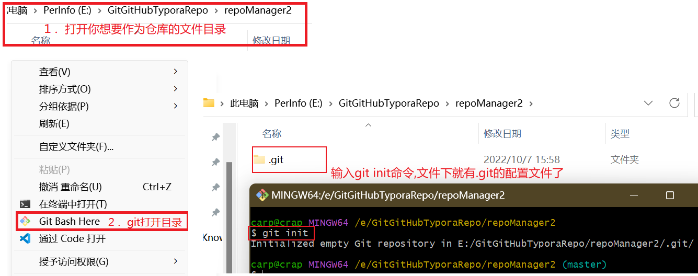

## 1. 分布式版本控制

**1. 版本控制是什么**

版本控制是一种记录一个或若干文件内容变化，以便将来查阅特定版本修订情况的系统。不仅可以对代码文件进行版本控制，对任何文件都可以进行版本控制．

**２. 集中式版本控制**

​		 集中化的版本控制系统(Centralized Version Control Systems，简称 CVCS)可以帮助在不同系统上的开发者协同工作. 这类系统，都有一个单一的集中管理的服务器，保存所有文件的修订版本，而协同工作的人们都通过客户端连到这台服务器，取出最新的文件或者提交更新。

​		这种做法带来了许多好处，特别是相较于老式的本地 VCS 来说。 现在，每个人都可以在一定程度上看到项目中的其他人正在做些什么。 而管理员也可以轻松掌控每个开发者的权限，并且管理一个 CVCS 要远比在各个客户端上维护本地数据库来得轻松容易。

​		事分两面，有好有坏。 **这么做最显而易见的缺点是中央服务器的单点故障**。 如果宕机一小时，那么在这一小时内，谁都无法提交更新，也就无法协同工作。 如果中心数据库所在的磁盘发生损坏，又没有做恰当备份，毫无疑问你将丢失所有数据——包括项目的整个变更历史，只剩下人们在各自机器上保留的单独快照。 本地版本控制系统也存在类似问题，只要整个项目的历史记录被保存在单一位置，就有丢失所有历史更新记录的风险。

 

 

**3.分布式版本控制系统**

​		分布式版本控制系统(Distributed Version Control System，简称 DVCS). 在这类系统中，像 Git、Mercurial、Bazaar 以及 Darcs 等，**客户端并不只提取最新版本的文件快照，而是把代码仓库完整地镜像下来**。 这么一来，任何一处协同工作用的服务器发生故障，事后都可以用任何一个镜像出来的本地仓库恢复。 因为每一次的克隆操作，实际上都是一次对代码仓库的完整备份。

  

**什么是仓库:** 用来存放代码的目录.


## 2. Git原理

### ２.1 Git基础

**==Git工作流程==**

>1. 在工作目录中添加、修改文件；
>2. 将需要进行版本管理的文件放入暂存区域；
>3. 将暂存区域的文件提交到 git 仓库。
>
>因此，**git 管理的文件有三种状态**：已修改（modified），已暂存（staged），已提交(committed)。
>
>**已提交**表示数据已经安全的保存在本地数据库中。 
>**已修改**表示修改了文件，但还没保存到数据库中。 
>**已暂存**表示对一个已修改文件的当前版本做了标记，使之包含在下次提交的快照中。
>
>如果 Git 目录中保存着的特定版本文件，就属于已提交状态。 如果作了修改并已放入暂存区域，就属于已暂存状态。 如果自上次取出后，作了修改但还没有放到暂存区域，就是已修改状态。 


**==Git本地的工作目录==**

  

Git 本地有四个工作区域：工作目录（Working Directory）、暂存区(Stage/Index)、资源库(Repository或 Git Directory)、git 仓库(Remote Directory)。

 

 


**==Git文件的状态==**

>​		版本控制就是对文件的版本控制，要对文件进行修改、提交等操作，首先要知道文件当前在什么状态，不然可能会提交了现在还不想提交的文件，或者要提交的文件没提交上。
>​		GIT 不关心文件两个版本之间的具体差别，而是关心文件的整体是否有改变，若文件被改变，在添加提交时就生成文件新版本的快照，而判断文件整体是否改变的方法就是用 SHA-1 算法计算文件的校验和。
>
>  
>
>
>
> 


==Git 在保存和对待各种信息的时候与其它版本控制系统有很大差异==，尽管操作起来的命令形式非常相近.

**1. 直接记录快照，而非差异比较**

>Git 和其它版本控制系统(包括 Subversion 和近似工具)的主要差别在于 Git 对待数据的方法。其它大部分系统以文件变更列表的方式存储信息。 这类系统(CVS、Subversion、Perforce、Bazaar 等等)将它们保存的信息看作是一组基本文件和每个文件随时间逐步累积的差异。存储每个文件与初始版本的差异.
>
>  
>
>
>
>
>Git 不按照以上方式对待或保存数据。 反之，==Git 更像是把数据看作是对小型文件系统的一组快照。 每次你提交更新，或在 Git 中保存项目状态时，它主要对当时的全部文件制作一个快照并保存这个快照的索引==。 为了高效，如果文件没有修改，Git 不再重新存储该文件，而是只保留一个链接指向之前存储的文件。 Git 对待数据更像是一个 快照流。
>
>这是 Git 与几乎所有其它版本控制系统的重要区别。 因此 Git 重新考虑了以前每一代版本控制系统延续下来的诸多方面。 Git 更像是一个小型的文件系统，提供了许多以此为基础构建的超强工具，而不只是一个简单的 VCS。
>
>  


**2. 近乎所有操作都是本地执行**

>在 Git 中的绝大多数操作都只需要访问本地文件和资源，一般不需要来自网络上其它计算机的信息。 因为你在本地磁盘上就有项目的完整历史，所以大部分操作看起来瞬间完成。
>
>举个例子，要浏览项目的历史，Git 不需外连到服务器去获取历史，然后再显示出来——它只需直接从本地数据库中读取。 你能立即看到项目历史。 如果想查看当前版本与一个月前的版本之间引入的修改，Git 会查找到一个月前的文件做一次本地的差异计算，而不是由远程服务器处理或从远程服务器拉回旧版本文件再来本地处理。 


**3. Git保证完整性**

>Git 中所有数据在存储前都计算校验和，然后以校验和来引用。 这意味着不可能在 Git 不知情时更改任何文件内容或目录内容。 这个功能建构在 Git 底层，是构成 Git 哲学不可或缺的部分。 若你在传送过程中丢失信息或损坏文件，Git 就能发现。
>
>Git 用以计算校验和的机制叫做 SHA-1 散列(hash，哈希)。 这是一个由 40 个十六进制字符(`0-9` 和 `a-f`)组成字符串，基于 Git 中文件的内容或目录结构计算出来。 SHA-1 哈希看起来是这样：24b9da6552252987aa493b52f8696cd6d3b0037
>
>Git 中使用这种哈希值的情况很多，你将经常看到这种哈希值。 实际上，Git 数据库中保存的信息都是以文件内容的哈希值来索引，而不是文件名。


###　２.2 Git安装与配置

**1. Linux下的安装**

>```shell
>sudo apt-install git   //安装git
>git --version          //查看git版本
>git --help
>git config --list      //查看git当前配置
>```


**2. Linux下Git的配置**

>此处配置主要是为git配置远程仓库, 在公司具体的开发时就会用公司的仓库名等信息.
>比如使用GitHub作为仓库时,就使用GitHub用户名和邮箱
>
>```shell
>##安装好后为git配置用户信息---设置用户签名,只用设置一次,不签名不能提交代码.
>$ git config --global user.name "用户名"
>$ git config --global user.email "邮箱名@yiibai.com"//git不会验证邮箱的真伪
>
>##获取公钥
>ssh-keygen -t rsa -C "youremail@example.com"  
>```
>
> 


**3. Windows下的安装**

>**网址**: https://git-scm.com/downloads 下载安装后,按照下面的步骤配置环境变量
>
>(1)使用 Win + S 打开，搜索「**环境变量**」，点击进入上方返回的「**编辑系统环境变量**」。
>
>(2)在打开的面板，点击右下角的**环境变量**。
>
>  
>
>(3)选中下方的「系统变量」中的「**Path**」，点击右下角的「**编辑**」。
>
>  
>
>(4)点击右侧的「新建」，最下方会弹出一个让我们输入内容的提示框，这里需要添加的是 **git.exe 的安装路径**。==一定是cmd下的git.exe==
>
> 
>
>
>
>在配好git的环境变量后可能鼠标右击没有出现==Git Bash Here==，可以按照下面的方法进行设置。便于我们使用git
>
>[鼠标右键没有git bash here，右键添加git bash here并增加图标_Feng&Y的博客-CSDN博客_鼠标右键没有git](https://blog.csdn.net/qq_41019529/article/details/110139830)


**4.Windows下Git的配置**

>对于我个人使用的是GitHub的仓库, 所以以GitHub仓库为例子
>
>```shell
>a>配置用户名： git config --global user.name  （Github上注册的用户名）
>b>配置用户邮箱：git config --global user.email  （GitHub上注册时的邮箱）
>
>c>在Git终端在输入: ssh-keygen -t rsa -C "xxxxx@example.com" ( GitHub上注册时的邮箱 )
>```
>
>  
>
>
>
>1. 得到公钥之后，打开 GitHub 官网，点击右上角的个人头像，选择 Settings 打开设置页面。
>
>  
>
>2. 左侧栏切换到 **SSH and GPG keys** 选项卡，点击右上角的 **New SSH key**。
>
>   
>
>3. 在打开的 SSH 配置页面，**在 Key 里面粘贴从 PowerShell 中复制的公钥**，而上面的 Title 可以随意写，可以写你当前正在使用的电脑名称
>
>   
>
>到这里就配置完了,现在就可以在Windows克隆仓库,更新仓库了.


### ２.3 git中的origin，HEAD，FETCH_HEAD

这几个概念比较抽象，可以在对git有一个简单的使用和了解之后再回过头来看

**==origin==**

​    	origin直白的理解就是源，可以代表远端仓库的地址。
​		比如：在本地我们随意的创建一个git仓库，新增一个readme.md文件，接着commit，然后再push。此时就会出现`无法读取远程仓库`的错误，这是因为我们只在本地建了一个仓库，并没有将本地仓库与远程仓库连接关联，git无法理解我们想要把本地的更新推送到那个代码托管平台，哪个仓库，所以就会报错。因此我们需要通过git命令将本地仓库与远程仓库进行关联，使用如下命令：

```shell
git remote add origin <远程仓库地址> 
//其实origin只是一个代名词，你也可以将他改为任意名字，只是用来指代远程地址的，一般都默认为origin
```

​		在git remote add的内部是往`.git/config`的文件中写入了一个`[remote "origin"]`的配置。如果你本地的仓库是通过 `git clone` 下来的，Git 会默认将远程仓库命名为 `origin`，自动帮你关联上远端仓库（可在 `.git/config` 文件中看到已有 `[remote "origin"]` 配置项了），因此 Commit 之后就能直接 Push 了

 


 **==远程分支Remote Branch==**

​		远程分支就是远程仓库对应分支在本地的一个副本。比如常见的 `origin/master`、`origin/main`、`origin/develop` 等都是远程分支，可以在 `.git/refs/remotes/` 目录下看到。`refs/remotes/origin/` 目录下，相应的分支文件记录的只是一个 `Commit-ID`（SHA-1），比较特殊的是 `HEAD` 文件（即 `origin/HEAD` 分支）记录的是 `ref: refs/remotes/origin/main` 的东西，它始终指向默认远程分支。


**==HEAD相关==**

1. **HEAD与本地分支相关**

>​		分支只是对 Commit-ID 的引用。每当在某个分支上提交代码，Git 都会产生一个全新的、唯一的 Commit-ID，此时我们的分支名称也随之移向最新的一个 Commit-ID。
>
> 		**HEAD 存放于本地仓库的 `.git/HEAD` 文件里面，利用 `cat` 命令可以看到它的内容。**比如：我们使用命令`git checkout dev`从main分支切换到dev分支，然后查看HEAD中的内容，发现HEAD的内容发生了变化。
>
> 
>
> 		此时 `HEAD` 只是对 Commit-ID 为 `866bc9f1d8f4797c0e46e959cb0c9abdd47d8176` 的引用。如果切回 `main` 分支，那么 `HEAD` 相应的内容就会跟着改变。而 `HEAD` 则是比较特殊的一个引用（有些文章称为「指针」，也问题不大）。除了 `git commit` 之外，`git checkout`、`git reset` 等命令都会影响 `HEAD` 的指向。
>
>> **当使用 `git commit` 时，`HEAD` 会跟着移动，并指向当前分支最新的 Commit-ID。**
>
>> **当使用 `git checkout` 时，`HEAD` 会移动并指向对应分支的最新一个 Commit-ID。**
>
>> **当使用 `git reset` 时，`HEAD` 会移动至对应分支的某个 Commit-ID。请注意 `git reset --hard` 可以将 `HEAD` 和 `Branch` 移动至任何地方。**git reset的本质就是移动HEAD达到撤销的目的。


2. **FETCH_HEAD**

>**`FETCH_HEAD` 指的是某个分支在远程仓库上最新的状态。**每一个执行过 `git fetch` 操作的本地仓库都会存在一个 `FETCH_HEAD` 列表，这个列表保存在 `.git/FETCH_HEAD` 文件中。`FETCH_HEAD` 文件中的每一行对应着远程仓库的一个分支。当前本地分支指向的
>
>```shell
>git fetch //拉取「所有远程仓库」所包含的分支到本地，并在本地创建或更新远程分支。所有分支最新的               Commit-ID 都会记录在 `.git/FETCH_HEAD` 文件中，若有多个分支，`FETCH_HEAD` 内             会多行数据。
>
>git fetch origin //拉取`origin`对应的远程仓库的所包含的分支到本地，`FETCH_HEAD` 设定同上。
>git fetch origin main //拉取 origin 对应远程仓库的 main 分支到本地，且 FETCH_HEAD 只记录                         了一条数据，那就是远程仓库 main 分支最新的 Commit-ID。
>
>git fetch origin mian:temp//拉取 origin 对应远程仓库的 main 分支到本地，其中 FETCH_HEAD                             记录了远程仓库 main 分支最新的 Commit-ID，并且基于远程仓库的                               main 分支创建一个名为 temp 的新本地分支（但不会切换至新分支）。
>```


## 3 Git命令使用

### 3.1 Git本地基础操作命令

#### 3.1.1 git init 初始化本地仓库  

​		git init 命令用来初始化一个空的 git 本地仓库。执行完 git init 命令，当前目录下会自动生成 .git 隐藏文件夹，该隐藏文件夹就是 git 版本库。

**==命令说明==**

>**功能:** 初始化一个空的git本地仓库
>
>**语法:** `git init [options]`
>
>```shell
>git init   //初始化一个空的git仓库
>git init --bare //初始化一个裸git仓库. 远端仓库我们都会初始化为裸仓库
>
>##git init 初始化的仓库，目录下只有一个 .git 隐藏文件夹，里面包含各种信息，而 git init --bare   表示创建一个裸库，主要应用场景是作为公共仓库. 
>##裸库的目录下没有隐藏 .git 目录，全都是显示的，没有 .git 这个目录，进入文件直接是文件内容，一般   来讲，作为远端备份或公共版本库时，应该使用 git init --bare。
>##git init –bare 方法创建一个所谓的裸仓库，之所以叫裸仓库是因为这个仓库只保存 git 历史提交的版   本信息，而不允许用户在上面进行各种 git 操作，如果你硬要操作的话，只会得到下面的错误（”This       operation must be run in a work tree”）。
>```


**==实例展示==**

>```shell
>git init   //创建一个普通的仓库,一般在本地使用
>```
>
>此方法可以把一个文件目录初始化为一个普通的仓库,可以看到有`.git`文件.
>
> 


#### 3.1.2 git clone克隆远端版本库

​		git clone 命令用来从远程主机克隆一个版本库。git clone 命令支持多种协议，比如：HTTP(s)、SSH、Git、本地文件协议。本地文件协议就是指:可以从本地一个磁盘克隆到另一个磁盘,形式上相当于复制,但本质有区别.

**==命令说明==**

>**功能:** 从远程主机克隆一个版本库.
>
>**语法:** `git clone url [dir]`    dir是对克隆后的仓库在本地重新命命名.

```shell
git clone 用户名@IP地址:/文件路径 本地路径  
## 需要输入远端的代码,参考scp命令.可以生公钥和密钥配置避免输密码
//用户名为远端服务器用户
//IP地址为远端服务器地址
```


`git clone`支持多种协议，除了HTTP(s)以外，还支持SSH、Git、本地文件协议等，下面是一些例子。

>```shell
>$ git clone http[s]://example.com/path/to/repo.git
>$ git clone http://git.oschina.net/yiibai/sample.git
>$ git clone ssh://example.com/path/to/repo.git
>$ git clone git://example.com/path/to/repo.git
>$ git clone /opt/git/project.git 
>$ git clone file:///opt/git/project.git
>$ git clone ftp[s]://example.com/path/to/repo.git
>$ git clone rsync://example.com/path/to/repo.git
>```


#### 3.1.3 git status查看本地库状态

​     git status 命令用于显示工作目录和暂存区的状态。使用 git status 命令能看到那些修改被暂存到了，哪些没有，哪些文件没有被 Git tracked 到。==master是本地仓库的分支, main是gitHub仓库的分支. 不同的远程仓库有不同的分支名==

**==命令说明==**

>**语法:** `git status [options]`    
>
>**参数options:**  `-s`  表示以简短的形式查看文件的修改状态
>
>**返回结果:** git status的返回结果有三个部分
>
>            1. 拟提交的变更:  已将放入暂存区,准备使用git commit命令进行提交.
>            2. 未暂存的变更: 工作目录和暂存区快照之间存在差异的文件列表.
>            3. 未跟踪的文件:  这类文件对于 Git 系统来说是未知的，也是可以被忽略的
>
>**返回格式:** git status -s的返回格式为  `XY PATH1 -> PATH2`
>
>```shell
>PATH1 表示最近一次提交的文件， -> PATH2表示索引或工作目录中文件，当文件路径改变时才会有 -> PATH2 这一项
>X 和 Y 都是状态码，X 表示暂存区和最近一次提交的差异，Y 表示工作目录和暂存区的差异。具体解释如下: 
>
>状态码    描述
> ``		unmodified(未修改的)
> M		modified(文件的内容或者mode被修改)
> A		added(本地新增的文件,远程仓库/服务器上没有的)
> D		deleted(本地删除的文件,远程仓库/服务器上还存在)
> R		renamed(文件名被修改)
> C		copied(文件的新拷贝)
> U		updated but unmerged(文件没有被合并,完成合并后才能提交)
> ??		untracked(未被git进行管理，可以使用git add file1把file1添加进git能被git所进行管理)
> !!		ignored(被忽略的文件)
> T      type(文件的类型被修改了)
>```


**==实例展示==**

>1.刚初始化的本地库状态查看
>   刚初始化的本地库一般会展示下面三条状态信息.
> 
>
>
>
>2.本地文件被修改后的状态查看
>
>   
>
> 


#### 3.1.4 git add追踪/添加文件

​       git add 命令是个多功能命令 ，根据目标文件的状态不同，此命令的效果也不同，可以用来：开始跟踪新文件、把已跟踪的文件放到暂存区还能用于合并时把有冲突的文件标记为已解决状态。

**==命令说明==**

>**功能说明:**  追踪新文件
>
>**语法:** `git add [options]` files
>
>**参数:** 
>
>```shell
>git add file   //仅追综file文件
>git add .      //他会监控工作区的状态树，使用它会把工作时的所有变化提交到暂存区，包括文件内容修                  改(modified)以及新文件(new)，但不包括被删除的文件
>git add -u     //他仅监控已经被 add 的文件（即 tracked file），他会将被修改的文件提交到暂存                   区。add -u 不会提交新文件（untracked file）。
>git add -A     //提交所有变化.A参数是上面两个参数的和，即添加所有文件。
>```


**==实例展示==**

> 
>
> 
>
>如果add后的文件不想要了,可以使用 ==git rm --cached file==去移除掉这个文件
>
>  


#### 3.1.5 git rm移除文件

​		git rm 命令用于从索引中删除文件或者同时从工作区和索引中删除文件。

**==命令说明==**

>**功能:** 从索引删除文件
>
>**语法**: `git rm [options] files`
>
>```shell
>git rm files    //同时从工作区和索引中删除文件，即本地的文件也被删除了。
>git rm --cached //从索引中删除文件，但是本地文件还存在， 只是不希望这个文件被版本控制。
>
>rm删除文件是物理上的删除,没有删除的记录,
>git rm是有纪录的删除
>```
>
> 


#### 3.1.6 git commit提交文件

​		git commit 命令主要是将暂存区里的改动提交到本地的版本库。每次使用 git commit 命令我们都会在本地版本库生成一个 40 位的哈希值，这个哈希值也叫 commit-id。commit-id 在版本回退的时候是非常有用的，它相当于一个快照，可以在未来的任何时候通过与 git reset 的组合命令回到这里。

**==命令说明==**

>**功能:** 将暂存区的改动提交到本地的版本库
>
>**语法:** `git commit [options]`
>
>**参数:**
>
>```shell
>## 注意:git commit 会直接打开一个文本让你写提交的信息,一般公司都会有提交信息的说明示例.
>## 有 -m参数时,双引号中就需要写上信息,不会单独打开一个文本.
>
>git commit -m "信息"    //提交版本库,加上指定信息
>
>git commit -a -m "信息" //-a 参数表示，可以将所有已跟踪文件中的执行修改或删除操作的文件都提交                          到本地仓库，即使它们没有经过 git add 添加到暂存区。
>
>git commit --amend     //追加提交，它可以在不增加一个新的 commit-id 的情况下将新修改的代码追                          加到前一次的 commit-id 中。
>```


**==实例展示==**

>  
>
>


#### 3.1.7 git log提交历史

​		git log 命令用于查看我们提交的 git 历史记录信息，同时，git log 命令可以通过多种不同的参数，定制显示的样式。

**==命令说明==**

>**功能:** 查看提交的git历史记录信息
>
>**语法:** `git log [options] files`
>
>`git reflog`   精简信息查看提交记录
>
>`git blame file` 以列表形式查看制定文件的历史修改记录
>
>```shell
>参数	          描述
>–oneline	 以简短方式输出 git log。
>–stat		 输出增删改的统计数据。
>-p			 输出每个 commit 具体修改的内容，输出的形式以 diff 的形式给出。
>–pretty		 自定义输出的信息。
>–author		 用来过滤 commit，限定输出给定的用户。
>-n			 限制要输出的数量。
>–after		 输出在指定日期之后的记录。
>–before		 输出在指定日期之前的记录。
>–grep		 搜索提交信息,也支持正常表达式（只能搜索标签、不可搜索内容）。
>–branchName	 branchName为任意一个分支名字，查看莫个分支上的提交记录。
>–graph		 以简单的图形方式列出提交记录。
>```


**==实例展示==**

> 
>
>HEAD指针指向的版本号可以改变,俗称回退版本.可以指向我们需要的版本.


#### 3.1.8 git checkout放弃本地修改

​		如果我们在本地工作区对某个文件做了修改，现在，我们想放弃本地工作区的修改，我们可以使用 git checkout 命令。

**==命令说明==**

>**功能:** 放弃指定文件的修改, 直接放弃的就是本地文件修改的内容
>
>**语法:** `git checkout -- file `
>
>
>
>此命令常和git reset一起搭配使用


#### 3.1.9 git reset回退版本

​		git reset 命令是用来将当前 branch 重置到另外一个 commit 的，这个动作可能同时影响到 index 以及 work directory。git reset 有三种工作模式，即 --soft、–mixed 和 --hard。

**==三种模式的区别==**

​		git reset 有三种工作模式，即，git reset --soft、git reset --mixed 和 git reset --hard。其中 git reset --mixed 是默认的方式。


> **git reset --soft**   仅仅移动当前 Head 指针，不会改变工作区和暂存区的内容，如下图所示：
>
>    
>
> 使用场景: 
>
> 1. 原节点和 reset 节点之间的差异变更集会放入 index 暂存区中(Staged files)，所以假如我们之前工作目录没有改过任何文件，也没 add 到暂存区，那么使用 reset --soft 后，我们可以直接执行 git commit 將 index 暂存区中的內容提交至 repository 中。
>
>    为什么要这样呢？这样做的使用场景是：假如我们想合并当前节点与 reset 目标节点之间不具太大意义的 commit 记录(可能是阶段性地频繁提交，就是开发一个功能的时候，改或者增加一个文件的时候就 commit，这样做导致一个完整的功能可能会好多个 commit 点，这时假如你需要把这些 commit 整合成一个 commit 的时候)时，可以考虑使用 reset --soft 来让 commit 演进线图较为清晰。总而言之，可以使用 --soft 合并 commit 节点。
>
> 
>
> **git reset --mixed**: 是 reset 的默认参数，移动 head 指针，改变暂存区内容，不会改变工作区 ，如下所示：
>
>  
>
> 使用场景:
>
> 1. 使用完 reset --mixed 后，我们可以直接执行 git add 将这些改变后的文件內容加入 index 暂存区中，再执行 git commit 将 Index 暂存区中的內容提交至 Repository 中，这样一样可以达到合并 commit 节点的效果（与上面 --soft 合并 commit 节点差不多，只是多了 git add 添加到暂存区的操作）；
> 2. 移除所有 Index 暂存区中准备要提交的文件(Staged files)，我们可以执行 git reset HEAD 来 Unstage 所有已列入 Index 暂存区的待提交的文件。(有时候发现 add 错文件到暂存区，就可以使用命令)。
> 3. commit 提交某些错误代码，或者没有必要的文件也被 commit 上去，不想再修改错误再 commit（因为会留下一个错误 commit 点），可以回退到正确的 commit 点上，然后所有原节点和 reset 节点之间差异会返回工作目录，假如有个没必要的文件的话就可以直接删除了，再 commit 上去就OK了。
>
> 
>
> **git reset --hard**: 当前 head 指针、工作区和暂存区内容全部改变 ，如下图所示：
>
>  
>
> 使用场景:
>
> 1. 要放弃目前本地的所有改变时，即去掉所有 **git add** 到暂存区的文件和工作区的文件，可以执行 git reset --hard HEAD 来强制恢复 git 管理的文件夹的內容及状态；
>
> 2. 真的想抛弃目标节点后的所有 commit（可能觉得目标节点到原节点之间的 commit 提交都是错了，之前所有的 commit 有问题）。
>
>    
>
>  –soft 用处不是很多，当 commit 之后想撤回 commit，但还不想覆盖工作区内容时，使用 --mixed；当想完全回滚时，使用 --hard 来覆盖工作区。


**==命令说明==**

>**功能:**有时候，我们用 Git 的时候有可能 git commit 提交代码后，发现这一次 commit 的内容是有错误的，那么有两种处理方法：==(1)修改错误内容，再次 commit 一次 ; (2)使用 git reset 命令撤销这一次错误的commit==第一种方法比较直接，但会多次一次 commit 记录，但如果修改过多的话，那么就不太方便去修改了，因此，这时候更适合使用第二种方式。
>
>```shell
>git reset HEAD~1 //回退一个版本，且会将暂存区的内容和本地已提交的内容全部恢复到未暂存的状态，不                    影响原来本地文件(未提交的也不受影响)。
>git reset -soft HEAD~1 //回退一个版本，不清空暂存区,将已提交的内容恢复到暂存区，不影响原来本地                          的文件(未提交的也不受影响)。
>git reset -hard HEAD~1 //回退一个版本，清空暂存区，将已提交的内容的版本恢复到本地，本地的文件                          也将被恢复的版本替换。
>```


**==git 回滚总结==**

>1. **修改完还未 git add **
>     修改完，还未 git add，使用 git checkout回滚：
>
>```shell
>git checkout . //使用暂存区的文件覆盖工作区，所以执行完 git add . 之后，再执行该命令是无效的。                  git checkout . 和 git add . 是一对反义词。
>```
>
> 
>
>2. **git add追踪了, 但还未commit**
>     使用 git add 提交到暂存区，还未 commit 之前，使用 git reset 和 git checkout 回滚：
>
>```shell
>##方法1:
>git reset      //先用 Head 指针覆盖当前的暂存区内容
>git checkout . //再用暂存区内容覆盖工作区内容
>
>##方法2:
>git reset --hard //直接使用 head 覆盖当前暂存区和工作区。
>```
>
> 
>
>
>
>3. **已经git commit还未git push**
>     已经执行了 git commit，但还没有执行 git push，使用 git reset 回滚：
>
>   ```shell
>   ##覆盖本地仓库、暂存区和工作区。
>   git reset --hard last_commit_id  //参数last_commit_id为提交的id号,
>   ```
>
>     
>
>4. **已经git push**
>
>   ```shell
>   ##情况1:修改错了,需要完全覆盖掉,使用: 
>   git reset --hard commit_id //commit_id为需要回滚的提交号,可以回退到任意提交的版本
>    
>   ##情况2:错误的把大文件添加到了缓存区,使用:
>   git reset  //撤回添加
>   ```
>
>   


#### 3.1.10  git diff比较不同

​		git diff 命令用于比较两个文件之间的不同，git diff 命令可以用来比较工作区、暂存区、工作目录以及两个分支之间的差异。

  


#### 3.1.11 git 忽略文件

很少使用到, 可以参照[git忽略文件-git怎么忽略文件-git ignore (haicoder.net)](https://haicoder.net/git/git-ignore.html)学习


### 3.2 git远程操作

#### 3.2.1 git remote查看远程仓库

**==命令说明:==**

>**语法:** `git remote [options]`
>
>```shell
>git remote -v    //查看远程仓库地址
>git remote show origin //查看远程仓库信息
>```
>
> 


#### 3.2.2 git remote rm 删除远程仓库

**==命令说明==**

>**语法:** `git remote rm [options]`
>
>```shell
>git remote rm 仓库名 
>```


#### 3.2.3 git remote rename 重命名远程仓库

**==语法说明==**

>**语法:** 
>
>```shell
>git remote rename oldname newname 
>//oldname 旧远程仓库名
>//newname 新远程仓库名
>```


#### 3.2.4 git修改远程仓库地址

**==语法说明:==**

>**语法:**
>
>```shell
>git remote set-url origin url
>//origin 远程仓库名
>//url 需要修改的新地址
>```


#### 3.2.5 git fetch 拉取远程仓库

如果远程主机的版本库有了更新（Git 术语叫做 commit），需要将这些更新取回本地，这时就要用到 git fetch 命令。**请注意 `git fetch` 并不会修改「本地分支」的代码。**

**==命令说明==**

>**语法:** `git fetch [options]`
>
>```shell
>git fetch //创建并更新本地远程分支
>git fetch origin //将origin远程主机的更新,全部取回本地
>git fetch origin dev //将origin远程主机的dev分支的更新全部取回本地
>```
>
>​		通过 `git fetch` 拉取代码的过程：先读取 `.git/config` 文件里面的配置 `[remote <remote-name>]`，将里面的所有（因为 `fetch` 并没有指定其中一个或多个远程仓库）远程名称对应仓库的分支下载到本地，并放在 `.git/refs/remotes/<remote-name>/` 目录下。
>
>


#### 3.2.6 git pull详解

​      git pull 命令的作用是，取回远程主机某个分支的更新，再与本地的指定分支合并。其实 git pull 就是 git fetch 与 git merge两个命令的合并 .    `git pull = git fetch + git merger`

**==命令说明:==**

>**功能:** 取回远程主机分支的更新, 并与本地合并
>
>**语法:** `git pull [options] [remote]`
>
>```shell
>git pull  //当前分支自动与唯一一个追踪分支合并
>git pull origin  //本地的当前分支自动与对应的origin主机"追踪分支"进行合并
>git pull origin next //取回origin/next分支, 再与当前分支合并
>git pull origin:master 取回origin主机的next分支, 与本地的master分支合并
>```
>
>一般来说,公司都会有自己的命令
>
>`git pull` 等价于 `git fetch` + `git merge FETCH_HEAD` 两个步骤的结合。拆分为两个步骤：
>
>1. `git fetch origin main`
>   将远程仓库的 `main` 分支最新 Commit-ID 记录到 `.git/FETCH_HEAD` 中，此时 `FETCH_HEAD` 指向该 Commit-ID。
>2. `git merge FETCH_HEAD`
>    将 `FETCH_HEAD` 对应的 Commit-ID 合并至本地 `main` 分支中。如果合并过程不存在冲突（即只是 Fast-Forward），那么可以顺利完成 `git pull` 最后一个步骤，否则的话，需要手动解决冲突。


#### 3.2.7 git push推送代码到远程

**==命令说明==**

>**功能:** 将本地分支的更新，推送到远程。推送的最小单位是分支
>
>**语法:** `git push <远程主机别名> <本地分支名>:<远程分支名>`
>
>```shell
>git push  //如果当前分支只有一个追踪分支,那么主机名都可以省略,表示将当前分支推送到origin主机对             应的分支.
>git push origin //将当前分支推送到 origin 主机的对应分支。
>git push origin master //将本地的 master 分支推送到 origin 主机的 master 分支。如果后者不                          存在，则会被新建。
>git push origin master:newdev //将本地的 master 分支推送到 origin 主机的 newdev 分支。如                                 果后者不存在，则会被新建。
>git push origin:master //删除远程仓库分支
>git push -u origin master //如果当前分支与多个主机存在追踪关系，则可以使用 -u 参数指定一个默                             认主机，这样后面就可以不加任何参数使用 git push。
>git push --all origin  //不管是否存在对应的远程分支，将本地的所有分支都推送到远程主机。
>git push origin --tags //把tag推送到远端仓库
>```


### ==3.3 git的分支操作==

​		**Git 中的分支，其实本质上仅仅是个指向 commit 对象的可变指针**。Git 会使用 master 作为本地分支的默认名字（gitHub克隆下来的仓库 以main为本地分支）。在若干次提交后，你其实已经有了一个指向最后一次提交对象的 master 分支，它在每次提交的时候都会自动向前移动。
​		**Git 中的分支实际上仅是一个包含所指对象校验和**（40 个字符长度 SHA-1 字串）的文件，所以创建和销毁一个分支就变得非常廉价。说白了，新建一个分支就是向一个文件写入 41 个字节（外加一个换行符）那么简单，当然也就很快了。

   

  

​		**其实 Git 中的「分支」是由一个或多个 `Commit-ID` 组成的集合。通过 `git branch` 命令创建的分支，只是对某个 `Commit-ID` 的「引用」。因此，使用 `git branch -d` 删除某个本地分支，也只是删除了这个「引用」而已，并不会删除任何的 `Commit-ID`。但是，如果一个 `Commit-ID` 没有被任何一个分支引用的话，在一定时间之后，将会被 Git 回收机制删除。**

​		分支的好处: 并行的进行多个功能的开发,开发效率高. 而且如果一个分支失败,并不会影响其他分支.删除失败的分支即可.


#### 3.3.1 查看分支

**==命令说明:==**

>**语法:** `git branch [options]`
>
>```shell
>git branch -a //查看所有分支,包括本地和远程分支
>git branch -r //查看远程分支
>git branch -v //查看所有分支最后一次提交的commitID
>```
>
> 


#### 3.3.2 创建分支

​		在 git 中，我们要创建一个本地分支，可以使用 git branch 命令，我们还可以使用 git checkout 命令，创建一个新的分支，并切换到该分支。

**==命令说明==**

>**语法:** 
>
>```shell
>##方法1: 
>git branch 分支名 commitID   //可以指定某一次的commitId为此分支
>//commitID为可选项
>
>##方法2: 
>git checkout -b 分支名 commitID  //创建某一个分支,并切换到这个分支
>
>##重命名分支
>git branch -m oldBranchName newBranchName
>```
>
> 


#### 3.1.3 切换分支

**==命令说明==**

>**语法:**
>
>```shell
>git checkout 分之名
>```
>
> 
>
>切换分之前记得保存之前分支的修改,不然会丢失修改,


#### 3.1.4 删除/清除分支

​		在 git 中，我们需要删除分支，可以使用 git branch 命令，删除本地分支，也可以使用 git push 命令，删除远程分支。使用 git push 命令删除远程分支的实现原理就是向远程的指定分支推送一个空分支代替原分支。

**==命令说明==**

>**语法:**
>
>```shell
>##删除分支
>git branch -d branchName  //删除本地分支
>
>git push origin :branch //删除远程分支
>//origin为远程主机名
>//branch为需要删除的远程分支
>
>##清除分支---删除在本地存在，但在远程已经删除的分支
>git fetch -p
>```
>
> 


#### 3.1.5 git merge 合并分支

**==命令说明==**

>**语法**
>
>```shell
>git merge branchName  //将待合并的分支与当前分支合并
>```
>
>在合并时,如果两个分支上有相同的文件被修改了,合并时就会产生冲突.此时就需要处理冲突


#### 3.1.6 合并冲突处理

**冲突产生的原因:** 合并分支时，两个分支在同一个文件的同一个位置有两套完全不相同的修改。Git无法决定我们要使用哪一个。必须人为的决定新代码的内容。产生冲突时会有MERGING的提示。

当Git无法执行自动合并时，因为更在在同一区域，它会用特殊的字符来表示冲突的区域，具体如下：
   


**==实例展示==**

>
>
>


## 4. GitHub


## git 实际使用时问题总结

### 1.代码被远程覆盖

**问题描述：** 代码写好了，提交时报如下错误，按照网上的方法pull远程仓库，然后还是没有提交成功。同时发现本地的文件更新的内容被覆盖。


**解决：** 只要自己有过commit，就会有commit记录，找到提交的记录然后恢复问题，

 **操作：** 

>1. `history` 查看自己的命令记录，确定误操作的地方
>
>   
>
>   git pull命令是取回远程主机的某个分支的更新，再与本地合并
>
>   多人协同开发时远端代码与本地冲突了，就需要处理冲突。git pull --rebase会帮我们新建一个新的分支，并在这个分之上处理冲突。
>
>2. `git reflog` 查看自己的提交记录
>
>    
>
>3. ` git reset --hard b48789b`  恢复到这个提交 


### 2. git push时提交错误

**问题描述：** 本地的分支和gitHub上的分支都是main，但是每次提交总是会报下面的错误，没有gitHub的仓库上改过任何东西给。


通过查阅得知这个文婷出现的原因是：**别人上传到远程仓库后，你没有及时的同步（拉取）到本地，但是你同时又添加了一些内容（提交），以致于你在提交时，它会检测到你之前从远程仓库拉取的时候的仓库状态和现在的不一样。于是，它为了安全起见拒绝了你的提交（然后就报了这个错误）。**

**解决方法：**

>**方法1：**先合并之前的历史，在进行提交。
>
>```shell
>git fetch origin main // 1.先把git的东西fetch到本地，
>git merge origin FETCH_HEAD // 2.抓取远程仓库的更新到本地，再合并。可能会产生冲突，要处理冲宊
>git pull --rebase origin main//3.重定基，使提交历史更加统一
>
>##命令说明
>git pull = git fetch + git nerge FETCH_HEAD  分开使用命令更加安全
>git pull --rebase = git fetch + git rebase FETCH_HEAD
>```
>
>
>
>**方法2：** 丢弃之前的历史，强推。利用覆盖的方式用本地代码替代git仓库的内容
>
>```shell
>##以下两个命令都可以强推，是一样的
>git push -f 
>git push -force
>```
>
>　
>
>使用强推一定是能成功的。
>
>　


 


