### 1.VMware Workstation安装

**VM下载地址：**[Windows VM | Workstation Pro | VMware](https://www.vmware.com/products/workstation-pro.html)

**VM激活码：**

>VMware Workstation 16 永久激活密钥
>ZF3R0-FHED2-M80TY-8QYGC-NPKYF
>YF390-0HF8P-M81RQ-2DXQE-M2UT6
>ZF71R-DMX85-08DQY-8YMNC-PPHV8
>
>不同版本的激活码可以去网上搜。

 

**VM旧版本卸载问题：**
卸载PC上原来的VM很麻烦，会遇到很多问题，但是按照下面的步骤就可以解决。其中主要问题就是卸载不干净。

>**1.关闭VMware虚拟机进程。**
>
>按下Ctrl + Alt + Delete，打开任务管理器，找到所有VM开头的进程，全部结束进程
>
> 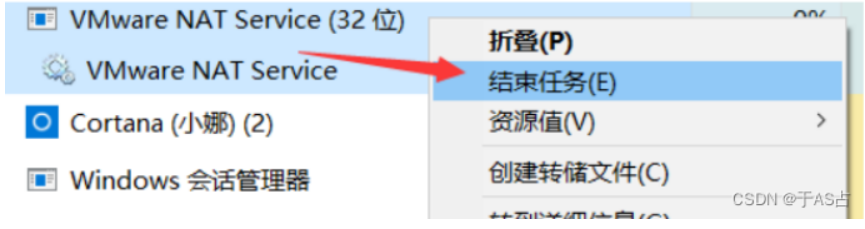
>
>  
>
>**2.禁用VMware虚拟机服务**
>
>Win+r--->"services.msc"在服务管理中，找到VM开头的所有服务类别，将所有VM开头的服务禁用掉。
>
>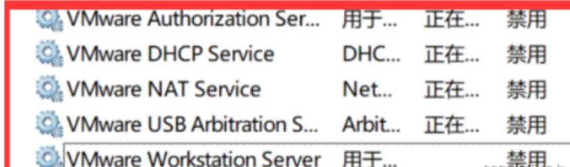 
>
>
>
>**3.删除卸载VMware虚拟机网络适配器**
>
>打开【计算机】——【属性】——【设备管理器】，找到网络适配器一项，看到里面所有VM开头的虚拟机网卡，全部右击【卸载】
>
>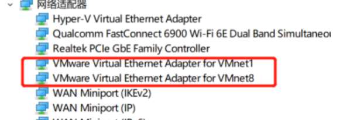 
>
>
>
>**4.注册表清理**
>
>Win+R快捷键，输入“regedit”，来到“注册表编辑器。
>
>找到“HKEY_CURRENT_USER”文件夹，点击它前面的“>”，打开它，然后在它的子目录下找到“Software”，打开，找到VMware.Inc，选中之后右键“删除”
>
>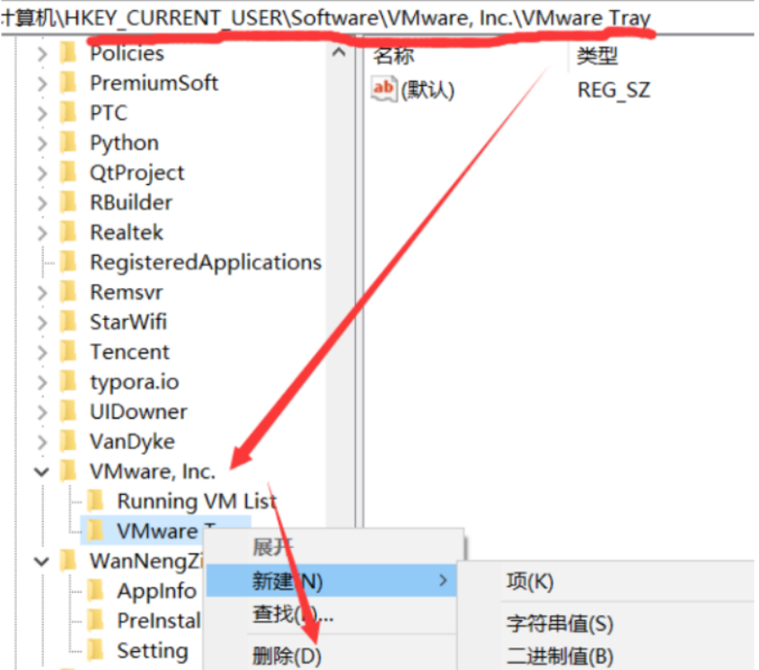  
>
>
>再看看这两个文件下有没有vmware相关的，有也一并删除
>
>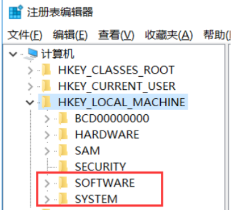 
>
> 
>
>**5.删除VMware安装目录文件**
>
>C:\Program Files (x86)\VMware
>
>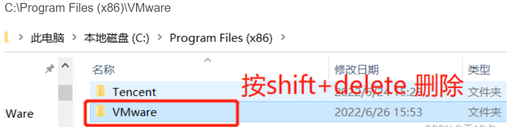   
>
>
>
>**6.卸载程序**
>
>控制面板 找到vmware安装程序，右键点击更改==>删除
>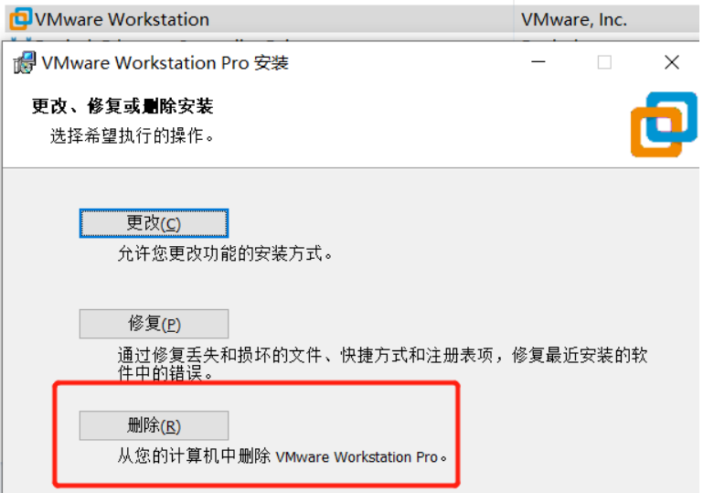 
>
>
>**7.打开Everything看看还有没有未清理到的文件**
>
>搜索VMware开头的，全部删除
>
>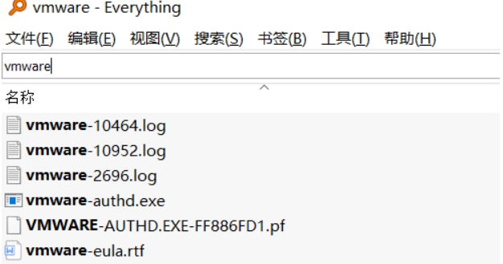 
>
>
>完成上述步骤后还是不能正常安装新的VM，再进行下一步。
>
>**8. 安装WindowsInstall Clean Up,完全清理注册表**
>
>软件的安装包可以直接在网上搜索就可以。
>
>WindowsInstall Clean Up的安装好后，在桌面没有快捷方式。可以打开其程序默认安装位置：`C:\Users\crap1\AppData\Roaming\Microsoft\Windows\Start Menu\Programs`,也可以使用everything去搜索这个程序，然后打开，将与VMware相关的全部删除。
>
>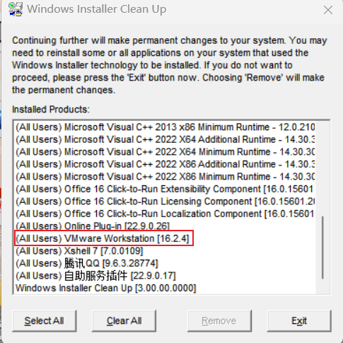 
>
>一般进行到这一步，都会解决问题。我自己感觉下一步的操作不是很必要，最重要的还是第8步。
>
>
>**9.安装CCleaner,修复注册表** 
>按照图上的步骤去修复就好，直到扫描不到任何存在的问题。
>
>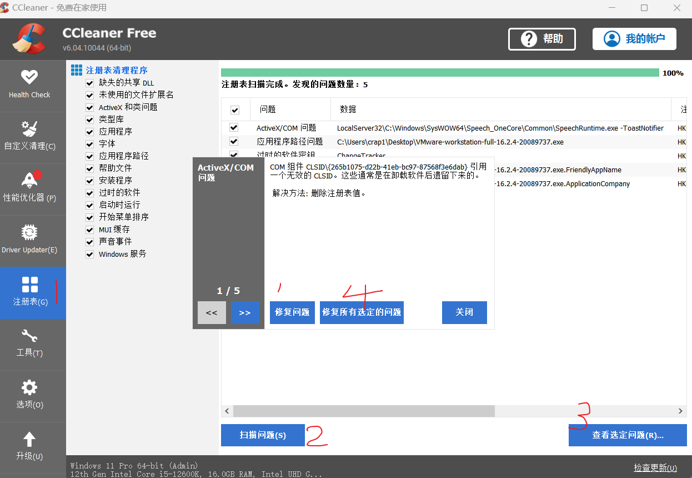  


### 2. Ubuntu介绍

==Ubuntu Desktop是由Canonical开发的Linux 发行版==，由于其易用性，它是最受欢迎的发行版之一。它也是刚开始使用 Linux 的人的首选之一。我们不会在此重点介绍的服务器版本也在大多数 Internet 服务器中运行。

那么什么是 Linux 发行版？==它是由 Linux 内核开发的操作系统==， 由 Linus Torvalds 于 1991 年创建的类 UNIX系统。Linux 发行版通常是免费和开源的，许多都是流行操作系统（如 Windows 和 macOS）的绝佳替代品。


### 3 linux和Windows双操作系统安装

双系统使用很方便,但是不利于学习和笔记。

目前主力仍是虚拟机装Ubuntu。


### 4 Ubuntu在VM虚拟机中的安装

#### 4.1 Ubuntu官网和镜像下载

==**官网**==：[Publisher of Ubuntu | Canonical](https://canonical.com/)

 		进入官网可以在 ：“products--> ubuntu-->Download-->Ubuntu Desktop ” 下载最新版本的系统。也可以在其他下载种找到以前的版本。[其他Ubuntu系统下载 | Ubuntu](https://cn.ubuntu.com/download/alternative-downloads)


#### 4.2 安装Linux

​		使用VM安装Ubuntu，[VMware虚拟机安装Ubuntu系统步骤详解 - sinanstar - 博客园 (cnblogs.com)](https://www.cnblogs.com/sinanstar/p/12596919.html#:~:text=1.打开VMware workstation 点击 创建新的虚拟机 ，进入新建虚拟机向导。 2.选择 自定义（高级） ，点击下一步。,稍后安装操作系统 ，点击下一步。 5.选择操作系统 Linux ，版本 Ubuntu 64位 ，点击下一步。) 。安装好之后就还需要进行其他简单的设置和操作。==主要是输入法和换源。==

>1.安装好之后,右上角网络设置的图标消失
>
>```shell
>原因:ubuntu网络管理工具NetworkManager发生错误.
>在Ubuntu21.10版本之后网络管理工具是NetworkManager,之前是network-manager
>
>sudo su # 获得管理员权限
>apt-get install gedit # 为系统安装gedit(一种文字编辑器)以便于修改文件
>gedit /etc/NetworkManager/NetworkManager.conf # 用gedit打开NetworkManager的配置文件
>将 managed=False 改为 managed=True ，然后 ctrl+s 保存后退出
>
>service NetworkManagerNetworkManager stop # 停止networkmanager
>rm /var/lib/NetworkManager/NetworkManager.state # 删除networkmanager的缓存
>service NetworkManager start # 重新启动networkmanager
>```
>
>
>2.安装VMware tools
>
>>(1)点击"虚拟机-->安装VMware tools"
>>
>>(2)进入到虚拟机中,打开右边的CD-DVD
>>
>>(3)将里面的虚拟机工具压缩文件夹复制到桌面,解压
>>
>>(4)/在终端中打开,运行.pl文件.
>
>
>
>3.设置共享文件夹,Ubuntu和Windows可以共用这个文件夹(未完成)
>
>>(1)安装VMware Tools工具
>>
>>(2)Windows先设置共享文件夹
>>
>>>1. 对需要共享为文件夹"右击-->属性-->共享"
>>>
>>>   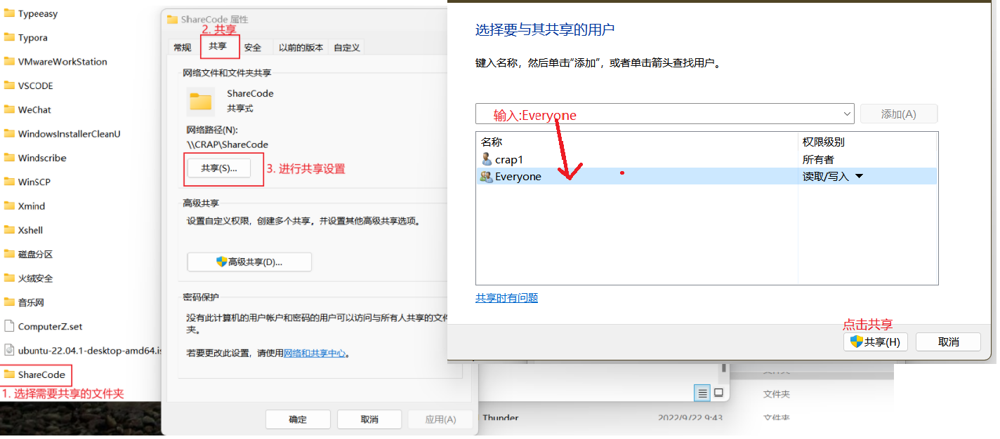 
>>>
>>>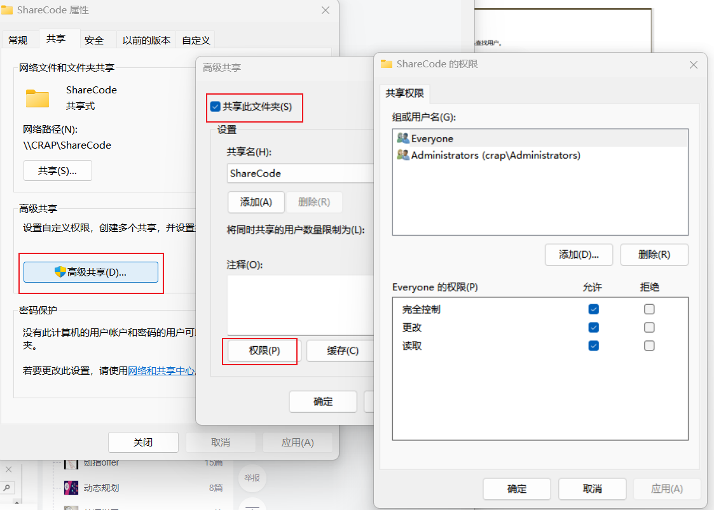 
>>>
>>>2. Windows还需要进行一些设置，保证共享成功，控制面板->网络和Internet->网络和共享中心->更改高级共享设置
>>>
>>>   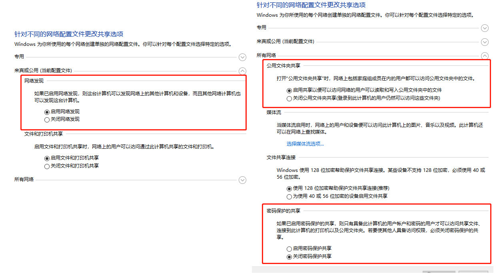 
>>>
>>>   
>>>
>>>   接着打开控制面板-->系统安全-->Windows 防火墙-->启用或关闭防火墙-->关闭防火墙
>>>
>>>   
>>
>>(3) Linux上进行挂载
>>
>>

#### 4.3 输入法设置（配置中文输入法）

​		Ubuntu中默认使用了英文键盘和输入法，可以通过fcitx和ibus配置不同的输入法。但是这两个输入法只能使用其中一个，推荐使用fcitx。[Ubuntu22.04安装Fcitx5中文输入法（详细） - 知乎 (zhihu.com)](https://zhuanlan.zhihu.com/p/508797663)


>==fcitx框架==配置：
>
>1.安装/卸载fcitx
>
>```bash
>sudo apt-get install fcitx //安装fcits
>
>sudo apt-get --purge remove fcitx  //卸载fcitx
>```
>
>2.安装搜狗输入法
>
>>2.1 下载搜狗输入法安装包：
>
>>​		搜狗输入法Linux版官网：https://shurufa.sogou.com/linux，有四个版本，根据电脑的芯片选择下载，大部分是第一个版本，如下图所示；
>
>>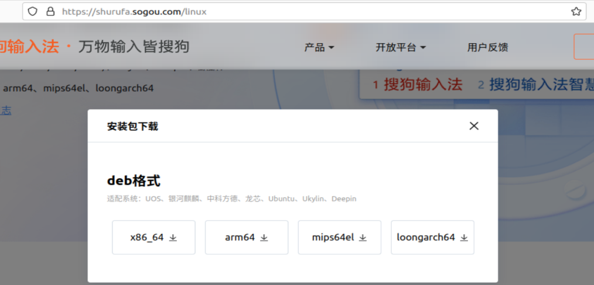 
>
>>2.2 设置输入法
>
>>​		安装完后打开设置中的预言支持。进行如下的设置。
>
>>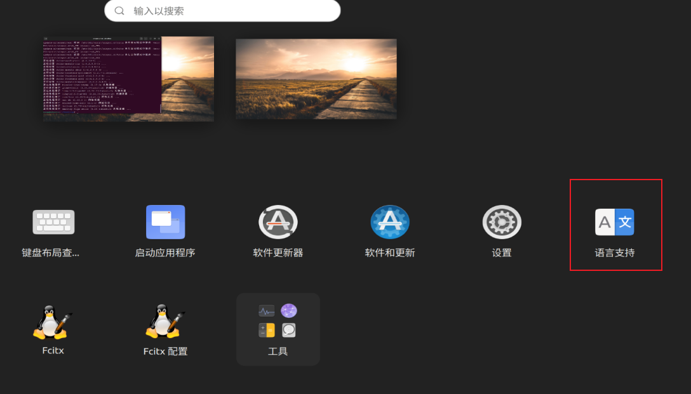 
>
>>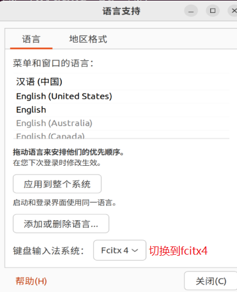   
>
>
>
>>  2.3 终端中进行设置
>
>> 打开终端输入以下的命令。
>
>>```shell
>>sudo apt install libqt5qml5 libqt5quick5 libqt5quickwidgets5 qml-module-qtquick2 -y
>
>>sudo apt install libgsettings-qt1
>>
>>```
>
>>重启电脑，在界面右上角有一个键盘图标，然后就可以看到输入法选择了。


### 5 换源

Ubuntu的服务器在国外，可能会有软件更新的问题，所以需要换镜像源来安装相关的软件个设置。

1.==简单换源==

> 在安装好Ubuntu后，如果最开始无法使用sudo apt-get update更新需要先设置一下源。具体如下：
>
> 1.打开设置，找到软件更新。
> 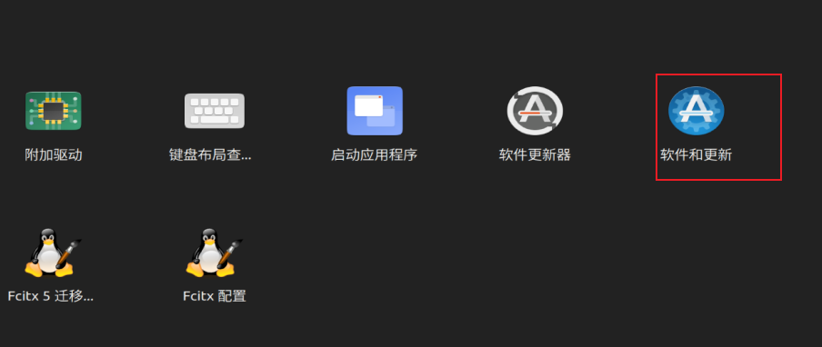 
>
>  
>
> 2.换国内的源
> 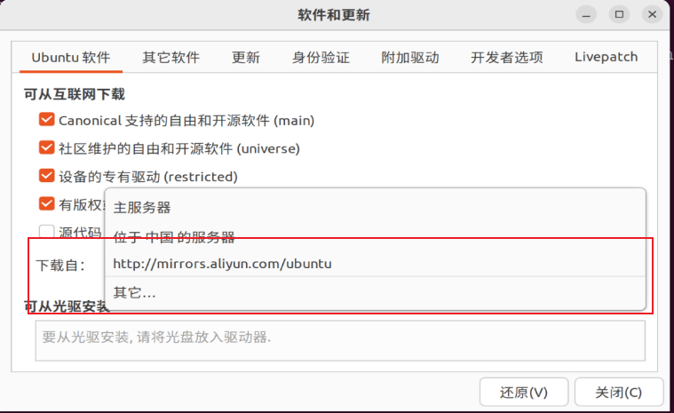  


2.==更改源文件换源==

每个发行版的Linux系统的LTS版本都有自己的代号，通过`lsb_release -a`可以查看代号codename。换源时也要和对应的代号对应上。

>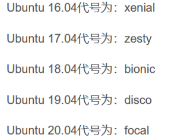  
>
>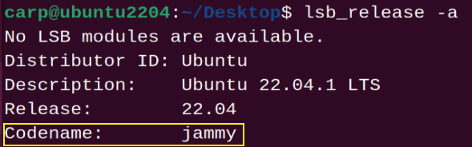  


>1.Ubuntu主流源地址，推荐清华源
>
>>**阿里源**：[ubuntu镜像_ubuntu下载地址_ubuntu安装教程-阿里巴巴开源镜像站 (aliyun.com)](https://developer.aliyun.com/mirror/ubuntu?spm=a2c6h.13651102.0.0.3e221b11CtFetu)
>>
>>**==清华源==**：[ubuntu | 镜像站使用帮助 | 清华大学开源软件镜像站 | Tsinghua Open Source Mirror](https://mirrors.tuna.tsinghua.edu.cn/help/ubuntu/)
>>
>>**中科大源：**[Ubuntu 源使用帮助 — USTC Mirror Help 文档](http://mirrors.ustc.edu.cn/help/ubuntu.html)
>>
>>**华为源：**[华为开源镜像站_软件开发服务_华为云 (huaweicloud.com)](https://mirrors.huaweicloud.com/home)
>
>
>
>2.换源步骤
>
>2.1 备份源文件
>
>```shell
>sudo cp -a /etc/apt/sources.list /etc/apt/sources.list.bak
>```
>
>2.2 修改sources.list文件，替换对应的网址。例如替换华为源
>
>```shell
>sudo sed -i "s@http://.*archive.ubuntu.com@http://repo.huaweicloud.com@g" /etc/apt/sources.list
>
>sudo sed -i "s@http://.*security.ubuntu.com@http://repo.huaweicloud.com@g" /etc/apt/sources.list
>```
>
>也可以到官网复制源文件文件linux下对应的文本中进行替换。如下所示：清华源
>
>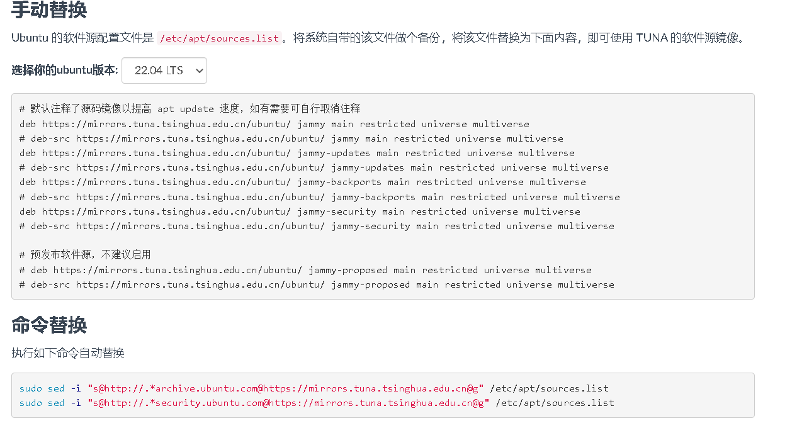 
>
>2.3 执行apt-get update更新索引


### 6 开发环境搭建

#### 6.1 SSH安装

​		SSH是Secure Shell的缩写，是一个建立在应用层上安全协议。SSH是较为可靠，专为远程登录，会话和其他网络服务提供安全性的协议。

>**安装**
>
>```shell
>sudo apt-get install openssh-server
>```


#### 6.2编译器安装


#### 6.3VScode配置


#### 6.4 Git与GitHub的使用

详细内容参照另一文件: `git的使用`


### 7 Github仓库与Git，Typora的同步更新

比较喜欢用typora来做笔记和记录，但是typora没有云同步功能，但是在windows环境下可以使用git和GitHub来打造我们自己的存储仓库，具体配置如下。

#### 7.1 Git安装和配置

1. [Git - Downloads (git-scm.com)](https://git-scm.com/downloads)直接下载安装

2. 配置Git环境变量。

   >(1)使用 Win + S 打开，搜索「**环境变量**」，点击进入上方返回的「**编辑系统环境变量**」。
   >
   >(2)在打开的面板，点击右下角的**环境变量**。
   >
   >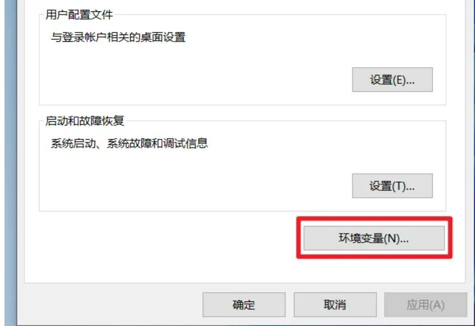  
   >
   >(3)选中下方的「系统变量」中的「**Path**」，点击右下角的「**编辑**」。
   >
   >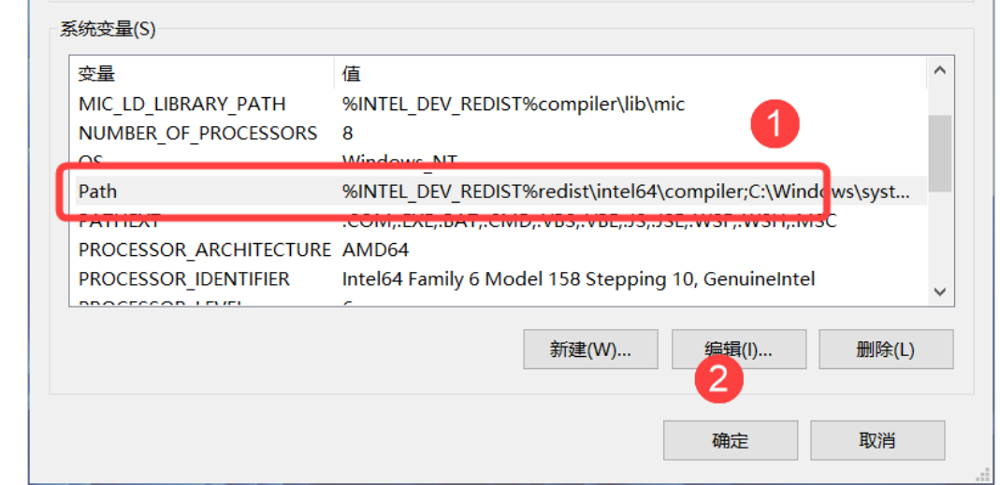  
   >
   >(4)点击右侧的「新建」，最下方会弹出一个让我们输入内容的提示框，这里需要添加的是 **git.exe 的安装路径**。==一定是cmd下的git.exe==
   >
   >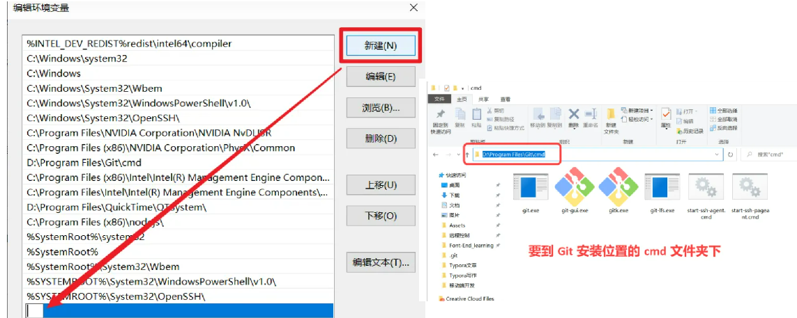 


在配好git的环境变量后可能鼠标右击没有出现==Git Bash Here==，可以按照下面的方法进行设置。便于我们使用git

[鼠标右键没有git bash here，右键添加git bash here并增加图标_Feng&Y的博客-CSDN博客_鼠标右键没有git](https://blog.csdn.net/qq_41019529/article/details/110139830)


#### 7.2 配置公钥

将我们电脑本地与远端的 GitHub 仓库连接起来，还需要用到**传输协议**，这里我们选择使用 **ssh 协议**。

**Git的原理:**

>仓库：**本地仓库**和**远程仓库**(托管在网络端的仓库)
>
>本地仓库：**工作区丶版本区，**其中版本区包含**暂存区丶仓库区**
>
>从本地仓库将文件git到远程仓库流程：**工作区----> 暂存区 ----> 仓库区 ----> 远程仓库**
>
>

​     所以我们需要先有一个仓库,可以先在Github上新建一个仓库。为了更好的分类整理，我将环境配置和开发知识技能树都放在了名为==1. configAndKnowledge==的仓库下面。每当学到新的技能或者相关开发环境的设置，都会在这个上面进行更新。


**配置方法：直接使用命令**

>a>配置用户名：git config --global user.name  （Github上注册的用户名）
>b>配置用户邮箱：git config --global user.email  （GitHub上注册时的邮箱）
>
>c>在Git终端在输入ssh-keygen -t rsa -C "youremail@example.com" ( GitHub上注册时的邮箱 )
>
>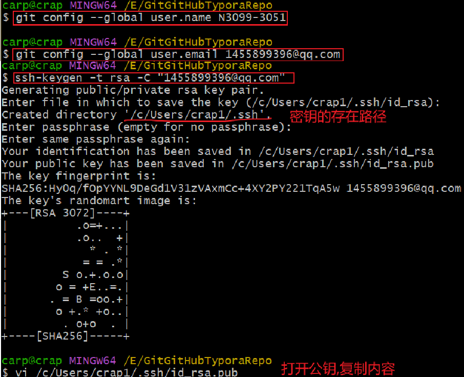  
>
>


#### 7.3 GitHub配置公钥

1. 得到公钥之后，打开 GitHub 官网，点击右上角的个人头像，选择 Settings 打开设置页面。

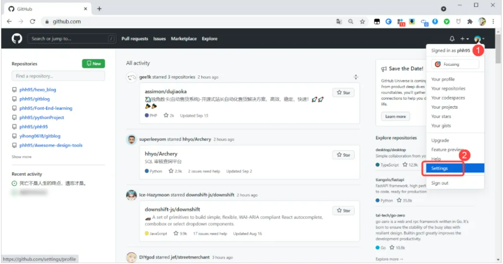  

2. 左侧栏切换到 **SSH and GPG keys** 选项卡，点击右上角的 **New SSH key**。

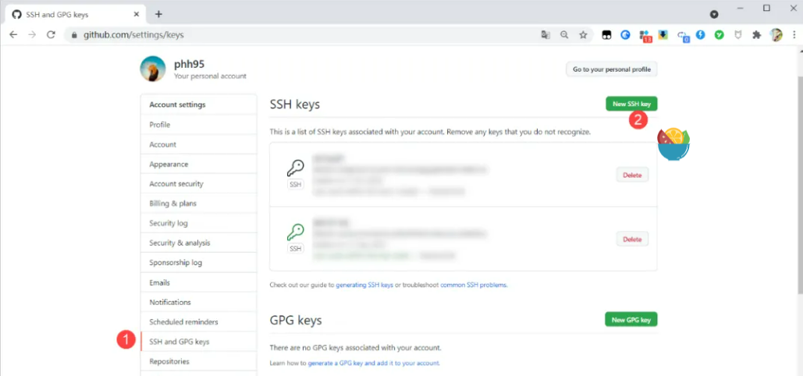  

3. 在打开的 SSH 配置页面，**在 Key 里面粘贴从 PowerShell 中复制的公钥**，而上面的 Title 可以随意写，可以写你当前正在使用的电脑名称

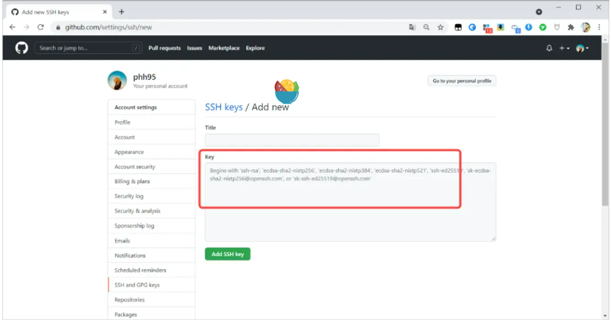  

到这里就配置完了,现在就可以在Windows克隆仓库,更新仓库了.

